# Spring 1

Con el fin de seguir los paradigmas de responsabilidad única usaremos interfaces

- Evento: Es la interface que implementaemos en nuestros eventos según las condiciones

- Condición: Es la interface que usaremos para crear nuestras clases con las condiciones medio ambientales

- Condiciones ambientales:
    - lluvia fuerte --> Alerta lluvia intensa
    - vientoo fuerte --> Alerta viento fuerte
    - temperatura alta y humedad alta --> Activar sistema de riego
    - Viento fuerte y temperatura alta --> Cerrar persianas
    - Presion baja --> Notificacion a usuarios sobre poca presión

## Clases

La estructura de las clases es muy similar debido a que implementamos desde la interfaz.

- Atributos: 
    -  Umbrales: existen 2 umbrales, el Alto y bajo, haciendo referencia a los puntos criticos o limite para indicar un estado de la condición del ambiente
- Metodos:
    - Existen 2 métodos importantes, isFar que indica si es una medición muy superior y isnotEnough como una medición por debajo del estandar

- Lluvia 

- Presion 

- Humedad

- Viento 

- Temperatura 

### SistemaClima
Esta es la clase principal donde todas clases se utilizan y se relacionan

- Atributos: Existen 5 atributos referido a cada medición

- Método: Existe un método DefinirEventos que según nuestras mediciones cumplan o no condiciones se agregaran eventos al sistema

### Eventos 

En los siguientes eventos se define el estilo mensaje que se mostrará, los métodos son muy similares

- Automatico

- Alertas

- Notificaciones

## Tests

Se crearon Tests para cada clase, de las 5 condiciones.
Estos tests son básicos y prácticamente los mismos pero evalúan los rangos en los que nuestros parámetros. Como se puede apreciar pasan todos

- Lluvia 

- Presion 

- Humedad

- Viento 

- Temperatura 

Ahora los tests para los eventos, que verifican los mensajes que se envían al crear un evento determinado. Se crearon para los 3 tipos de eventos

### Stubs

Usaremos stubs en la clase principal, osea el SistemaClima

Como se definieron 5 escenarios para cada evento, con la ayuda de stubs verificaremos que eso se cumpla 
- Caso lluvia intensa, Caso Viento Intenso
Usaremos nuestros parámetros para simular los escenarios reales y de ser correcto nuestra clase debería de retornarnos un Array que contenga nuestro evento en particular
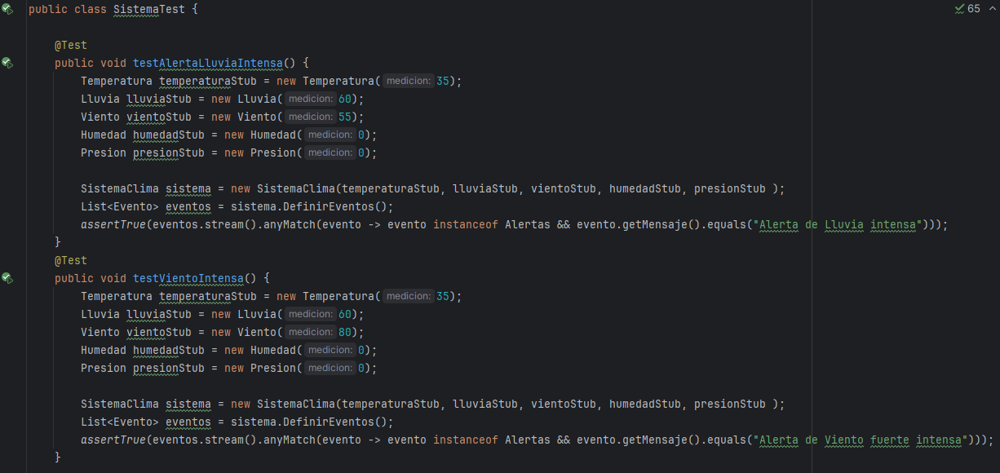

- Caso Alta Temperatura  y alta Humedad

De igual manera se testea estos escenarios
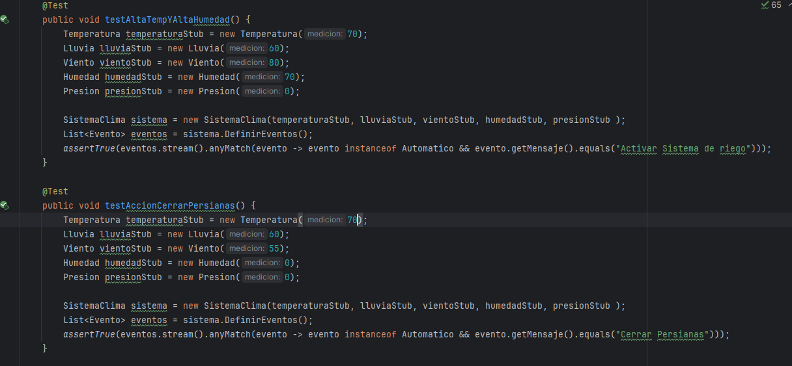

- Caso Notificación 

Finalmente testeamos el caso de la notificación
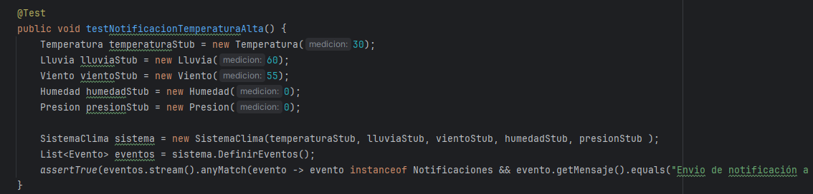

### Fakes

Se crea la clase FakeNotificaciones para simular el envio de notificaciones a usuarios

- Atributos: se tiene un mensaje y un array de usuarios
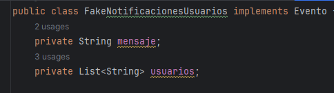

- Metodos : Se tiene getMensaje para agregar los usuarios al mensaje final
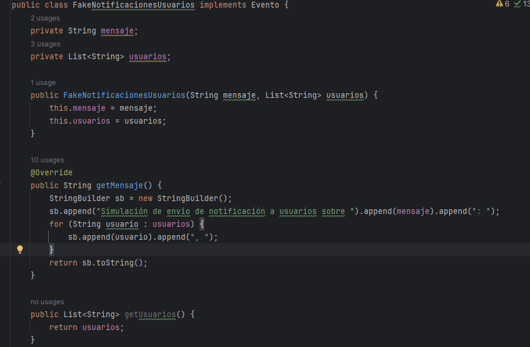

#### Test

Testeamos la correcta creación del mensaje con todos los usuarios ingresados, posteriormente verificamos con assertTrue la correcta ejecución
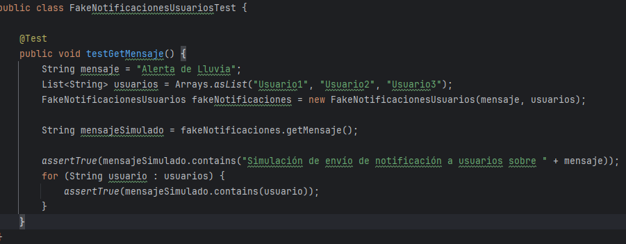

## Métricas de calidad

### Jacoco
Usaremos jacoco para medir la cobertura de las pruebas, luego de todas las tests creado. Ya que son muchos tests la cobertura tiene un buen porcentaje

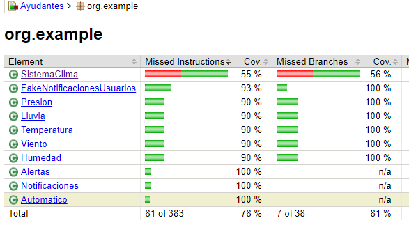
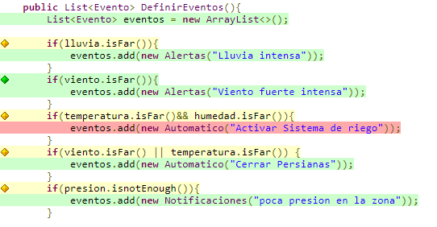

Intentaremos mejorar la cobertura implementando más tests, que antes ya fueron explicados en SistemaClimaTest

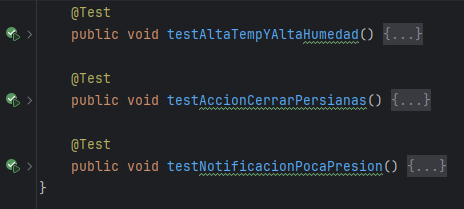

Nos resulta en una mayor cobertura

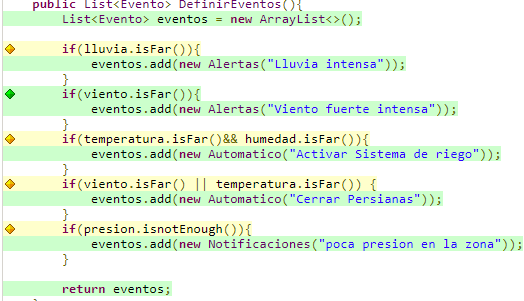

Lo que aumenta la cobertura

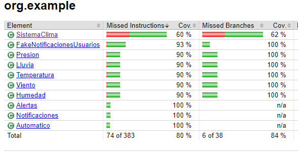

### Pitest

Lo mismo utilizando Pitest
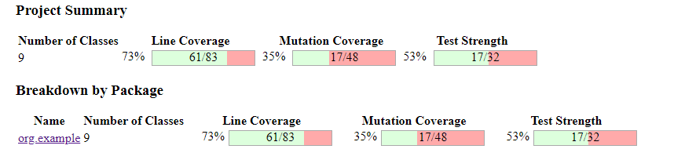

La cobertura de mutación aumenta

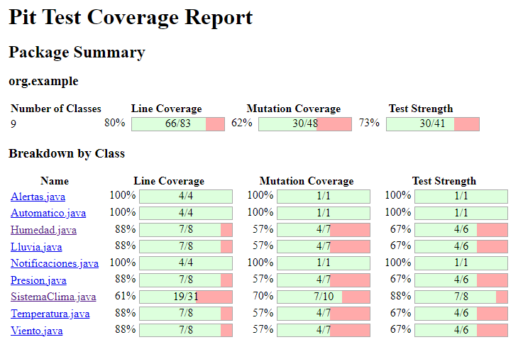

### Complejidad Ciclomática

Recordando la definición de cohesión y acoplamiento

- Cohesión: Hace referencia al grado se mantienen juntos con un solo propósito

- Acoplamiento: Hace referencia a la dependencia entre modulos( clases )

La complejidad ciclomática se calcula según este calculo
    M = e - n + 2p

- e(aristas): número de transiciones entre nodos
- n(nodos): número de nodos en el grafo del flujo
- p(componentes): número de componentes conectados

Debido a que usé el principio Dependency Inversion Principle(DIP), sin embargo, existe una alto acoplamiento en la clase SistemaClima, en la parte DefinirEventos()

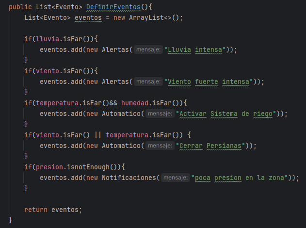

Calculamos su complejidad:

Cada if sin contar la evaluación de la condición
nodos (n): 1+2+2+3+3+2+1=14

Cada if vale 1 * condiciones en su condicional
aristas (e): 1+2+2+3+3+2+6=19

p(componente): 1

M= 19 - 14 + 2 * 1

M= 7
### Refactorización

Reducimos el acoplamiento, creando un método para cada evento

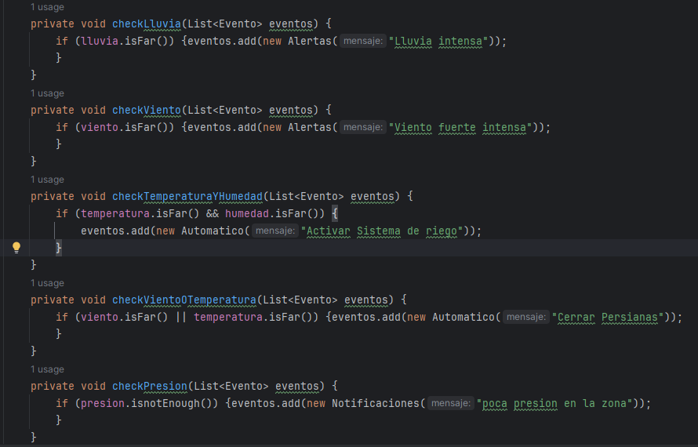

Y se usa en el método DefinirEventos

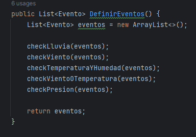

reduciendo el acoplamiento