# Sprint 2

## Contenerización del Sistema

Necesitamos configurar un Dockfile para dockerizar las clases, creamos un main en SistemaClima para poder ver algo en la ejecución de nuestra imagen en el contenedor
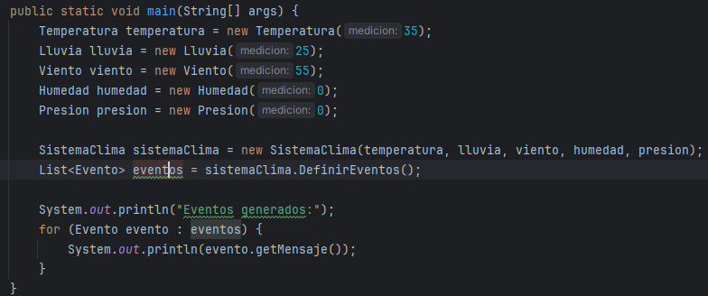

En el dockerfile indicamos en la línea 14 la clase que vamos a correr como main y poder ver el output

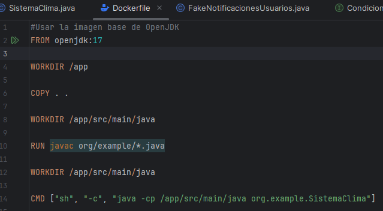

### Docker build

Creamos la imagen y la llamamos sistemaeventos
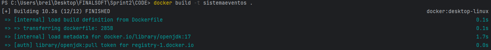

Corremos el contenedor con el mismo nombre y ejecutamos la imagen dentro
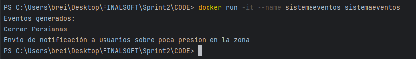

### Docker-compose

Por el momento no estamos utilizando una base de datos pero se comenta como sería el proceso de agregar una base de datos. Se tiene que llamar la imagen como nuevo servicio 

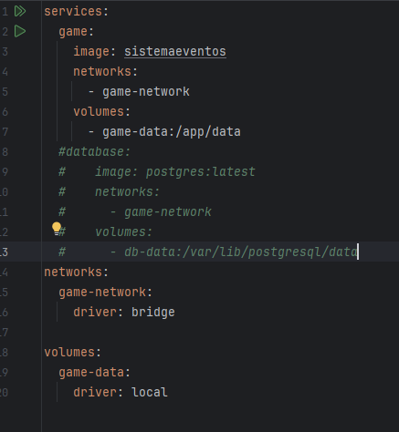

Podemos crear e incorporar servicios de otro lenguaje mediante el docker-compose

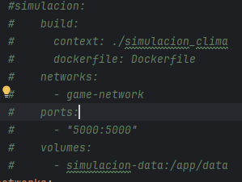

Ejecutamos docker-compose up -d para levantar todos los servicios indicados en el docker-compose
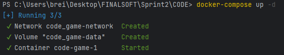

## Refinamiento del TDD

Vamos a agregar unos cambios interesantes, ya existen 5 clases que representan 5 parámetros. Por eso utilizaremos el patrón Estrategia para agregar un sistema de predicciones fake, que recibirá los parámetros pero devolverá valores ya determinados 

### Patrón estrategia

Definiremos dos estrategias, una para eventos y otra para predicciones

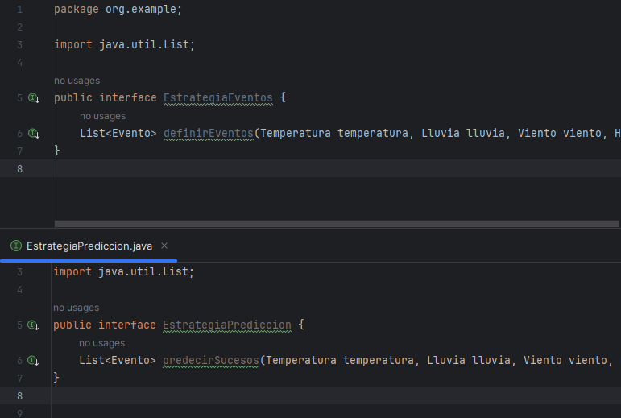

nos permitirá darle más acciones a nuestro funcionalidades a nuestro sistema de clima

- EstrategiaEventosOriginal

Creamos la estrategia original que se definió al inicio del examen, sin cambios

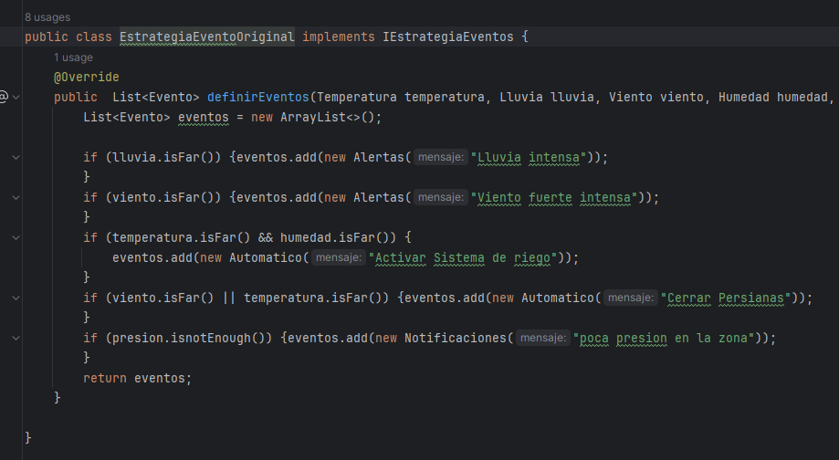

- FakeEstrategiaPrediccion

Creamos un Fake que nos dará predicciones sobre el futuro dependiendo de nuestros parámetros

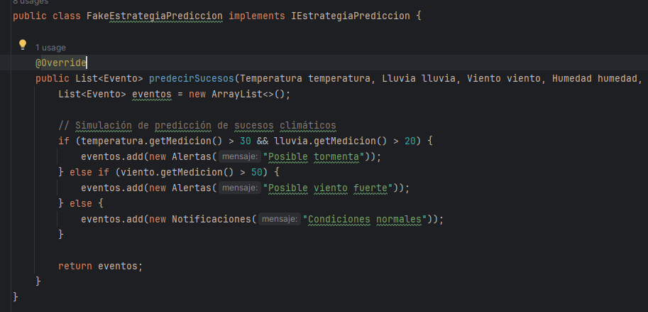

- Cambios en la clase SistemaClima

Ahora los atributos son las estrategias y los métodos son las acciones que puede hacer nuestro sistema, en este caso predecir o alertar sobre eventos.

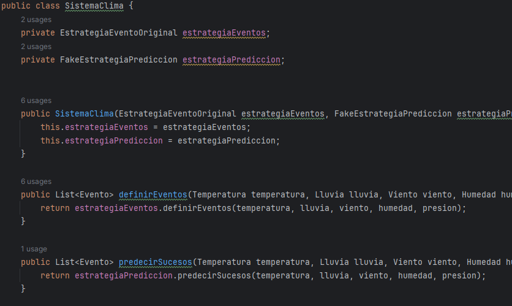

Entonces así podemos tener avisos y predicciones en nuestro sistema

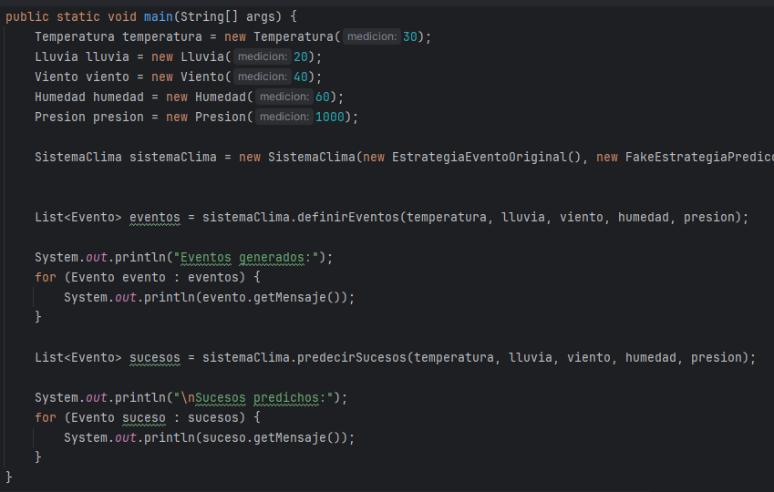

### Tests

Agregamos los tests para el fake 

Estos verifican si se genera una predicción los parámetros del ambiente, el primer test verifica que no se genera una predicción si no cumple con los valores

La segunda y la tercera verifican que se prediga correctamente según los parámetros

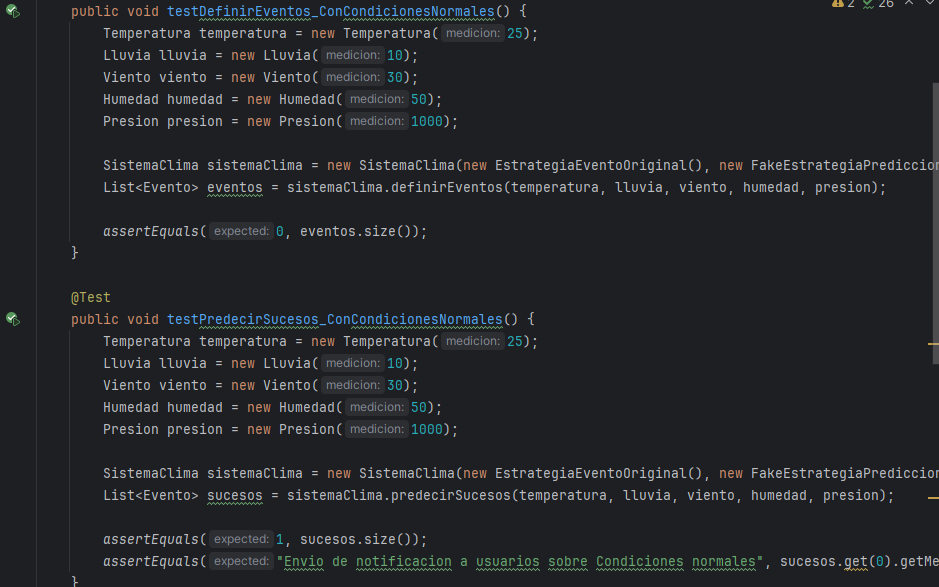
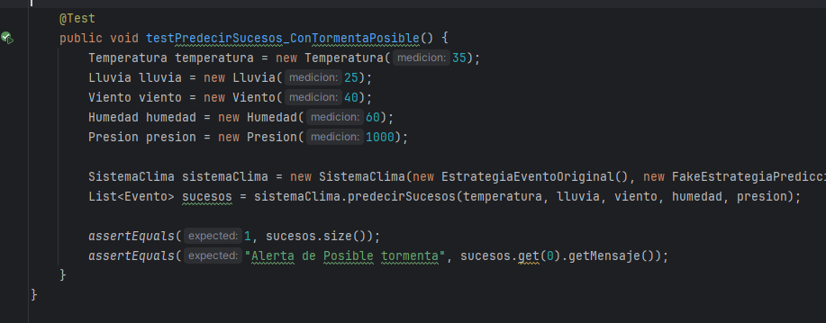

Al ejecutar todos los tests vemos que corren perfectamente

- Resultado
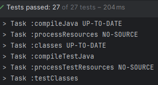
### Dockerizar los tests

La versión anterior de nuestro Dockerfile no era muy útil para dockerizar los tests, no cargaba todas las dependencias y habían clases faltantes

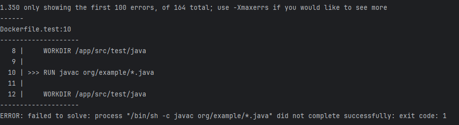

Por esta razón es conveniente usar gradle para cargar todos los tests y dependencias, ya que es el comando por defecto para ejecutar todos los tests
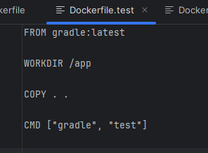

Construimos la imagen

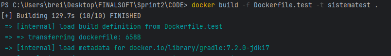

Corremos la imagen en un contenedor

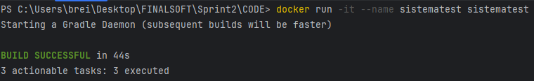

## Mejora de la estrategia de pruebas

- Integrar las pruebas unitarias y de integración en el pipeline de Docker.

Como se mostró en la sección anterior los test cargaron en la imagen docker luego de los cambios

- Asegurar que los stubs y fakes funcionen correctamente en el entorno contenerizado

Verificamos que la construcción fue exitosa por lo tanto todos los tests pasaron

## Refactorización y código limpio

En cuestión de refactorización seguir principios DIP y patrones de diseño simplificaron mucho el desarrollo de este examen.

- DIP y patrón estrategia

## Métricas de Calidad

Finalmente ejecutaremos las pruebas de cobertura pitest y jacoco mediante microservicios.

### Configuración dockerfile

Inicialmente mi dockerfile lucía así 

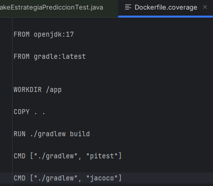

sin embargo, daba muchos errores a la hora de usar build run

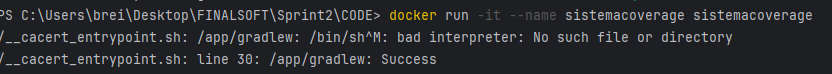

Por ese motivo tuve que cambiarlo a esta versión

Esta versión tiene configuración de permisos de ejecución y sed -i  seguido de un regex que soluciona el error que me daba mi /bin/bash ya que había un error de interpretación

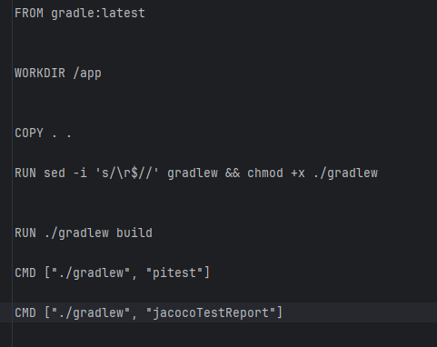

Luego de esos cambios 

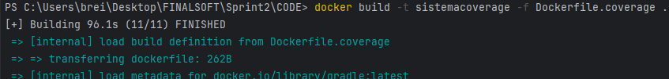

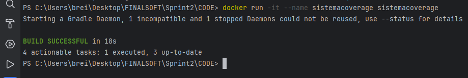